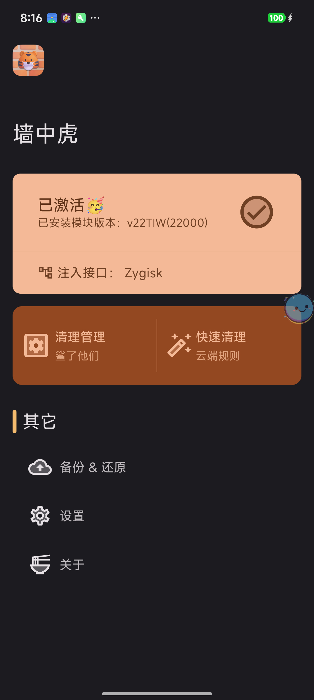
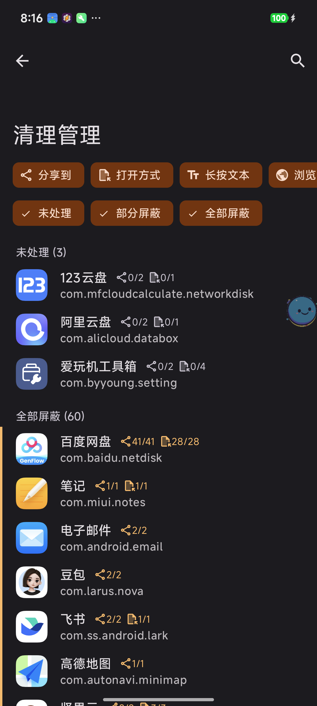
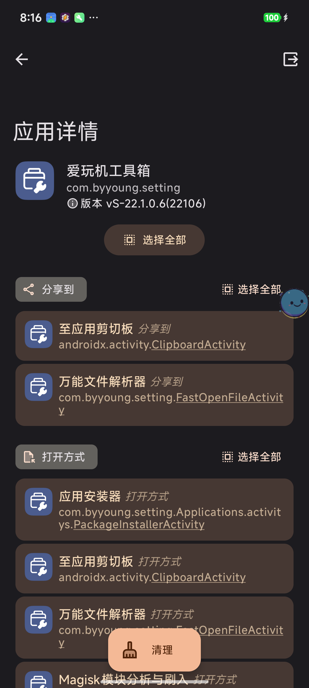
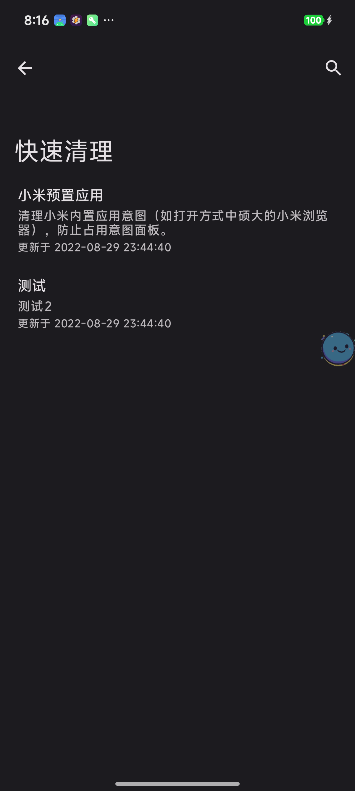
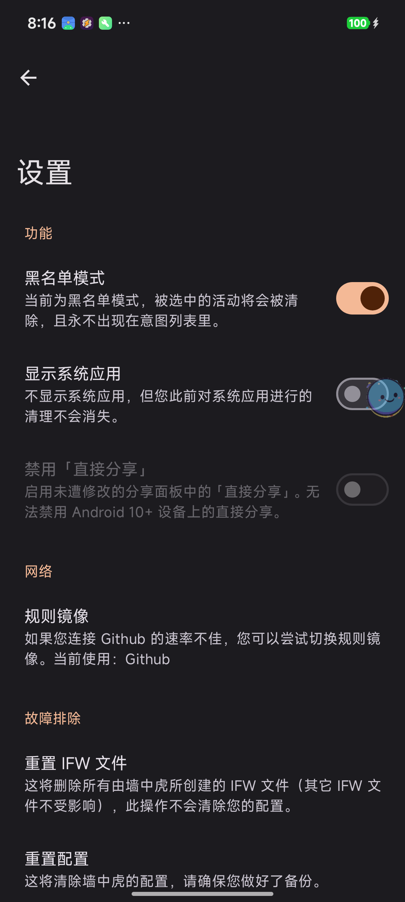

# TigerInTheWall

A 🐯Tiger hides in the wall, waiting to 💀bite the "Intent" passby. 

🚫Block annoying superfluous Intent for your Android devices. 

👺Magisk needed, named as RnIntentClean before.

TigerInTheWall is an App that allow you to clean up your sheets, just like sharesheet, open mode sheet and more!

# Screenshots

| Main | Clean Manager | App Details | Quick Clean | Settings |
|:---:|:---:|:---:|:---:|:---:|
|  |  |  |  |  |

Works with the Magisk modules **IFWEnhance-TIW**, and root permission.
> IFWEnhance-TIW: [https://github.com/TigerBeanst/Riru-IFWEnhance-TIW/releases](https://github.com/TigerBeanst/Riru-IFWEnhance-TIW/releases)
> 
> If you use Riru, you need to install Riru - Core before. Recommend use Zygisk version.

# Tested
1. Hydrogen/Oxygen OS with Android 10
2. MIUI 12 with Android 10

# License

    Copyright (C) 2020 TigerBeanst

    Licensed under the Apache License, Version 2.0 (the "License");
    you may not use this file except in compliance with the License.
    You may obtain a copy of the License at

        http://www.apache.org/licenses/LICENSE-2.0

    Unless required by applicable law or agreed to in writing, software
    distributed under the License is distributed on an "AS IS" BASIS,
    WITHOUT WARRANTIES OR CONDITIONS OF ANY KIND, either express or implied.
    See the License for the specific language governing permissions and
    limitations under the License.

*Google Play and the Google Play logo are trademarks of Google LLC.*